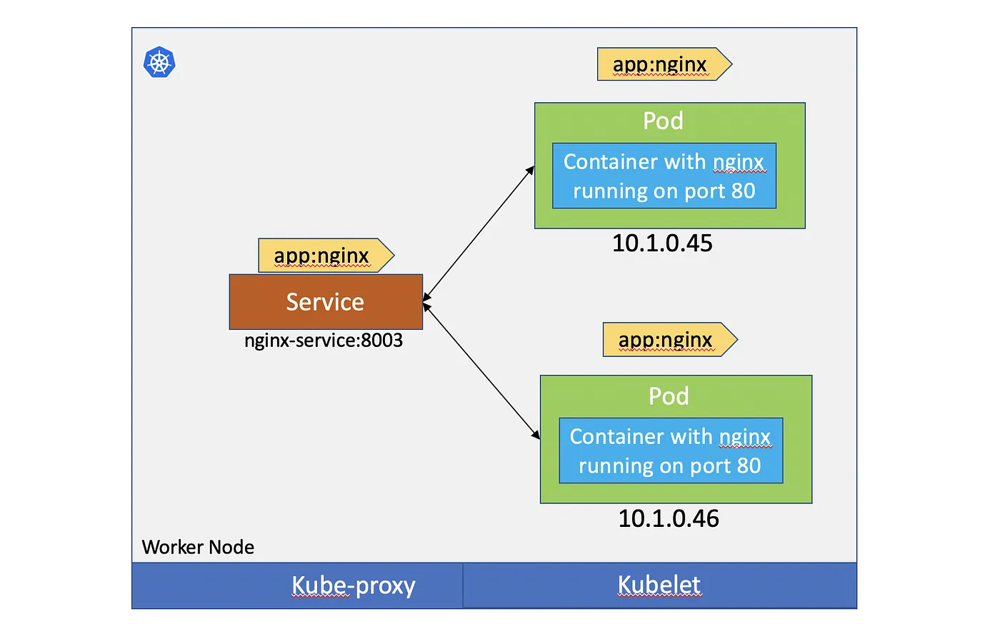
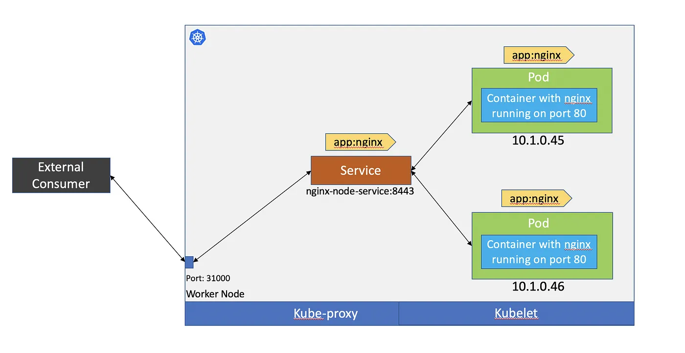
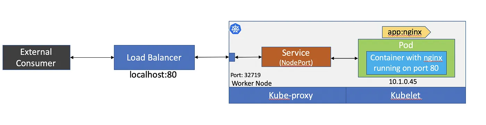
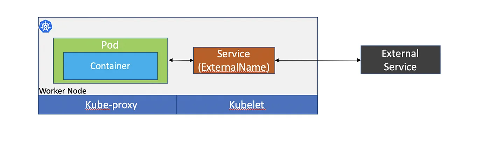

# Kubernetes: Key Concepts and Its Role in Microservices Development

Kubernetes (K8s) is an open-source container orchestration platform designed to automate the deployment, scaling, and management of containerized applications. It has become a critical part of modern microservices architecture, enabling seamless operation and scaling of services across distributed systems. Below, we discuss key concepts and align them with microservices development and operations.

## 1. **Containers and Pods**

### Containers:
Containers encapsulate a microservice along with its dependencies, ensuring consistency across environments. Kubernetes manages these containers at scale.

### Pods:
- The smallest deployable unit in Kubernetes, a pod, usually encapsulates one or more containers that share the same network and storage.
- In microservices, each service runs in a separate pod, maintaining independence while allowing Kubernetes to handle container lifecycle management.

**Microservices Alignment**:  
In a typical microservices application, each service is encapsulated within its own container. Kubernetes orchestrates the deployment of these containers as pods, ensuring services are isolated, scalable, and independently managed.

## 2. **Deployment and Scaling**

### Deployments:
A Kubernetes Deployment defines how to manage a group of pods. It ensures that a specified number of pod replicas are running at all times and can roll out updates seamlessly.

### Horizontal Pod Autoscaler (HPA):
Kubernetes provides autoscaling capabilities by adjusting the number of pod replicas based on CPU/memory utilization or custom metrics.

**Microservices Alignment**:  
In a microservices ecosystem, Kubernetes deployments ensure that your services are continuously available and can scale as demand increases. The autoscaler provides automatic scaling based on traffic or load, ensuring smooth performance under fluctuating workloads.

## 3. **Service Discovery and Load Balancing**

### Services:
Kubernetes Services enable communication between pods and external clients. They provide load balancing across multiple pods and service discovery to manage internal communication.

**Types of Services**

1. **ClusterIP** - exposed internally within the cluster. Only Pods within the cluster can talk to the Service. It enables Pods to talk to other pods in the cluster without having to use their IPs.
  

2. **NodePort** - allows to expose services on each Node’s IP at a static port. Therefore, it allows accessing the service from outside the cluster.

3. **LoadBalancer** - the standard way to expose our services externally. It is useful when combined with a cloud’s provider load balancer. With LoadBalancer service, NodePort and ClusterIP services are created under the hood.

4. **ExternalName** - acts as an alias for external service. Allows to define a service once that would proxy the request to this external service. If the external service DNS IP address changes, update will simple be needed on ExternalName service instead of od Pods. 

### Ingress:
An Ingress manages external access to the services within a Kubernetes cluster, offering load balancing, SSL termination, and routing capabilities.

**Microservices Alignment**:  
Kubernetes services and ingress controllers manage internal and external communication for microservices, ensuring that services can discover and interact with each other in a dynamic environment. Spring Cloud Kubernetes can be used to integrate service discovery and configuration within your Spring Boot applications.

## 4. **ConfigMaps and Secrets**

### ConfigMaps:
Used to externalize configuration, allowing microservices to be decoupled from environment-specific configurations (e.g., database URLs, API keys).

### Secrets:
Handle sensitive information, such as passwords and tokens, in an encrypted manner, ensuring secure access to protected resources.

**Microservices Alignment**:  
In microservices, each service has unique configuration requirements. Kubernetes’ ConfigMaps and Secrets enable microservices to fetch configuration data dynamically without redeploying services. This is crucial for scaling services across multiple environments.

## 5. **Stateful and Stateless Applications**

### Stateless:
Most microservices are stateless and can be scaled easily because no state is stored between requests.

### StatefulSets:
Kubernetes provides StatefulSets for managing stateful applications, ensuring ordered deployment and stable network identity.

**Microservices Alignment**:  
Microservices are typically stateless, but in scenarios where state persistence is required (e.g., databases, messaging queues), StatefulSets can be used to manage stateful services. Kubernetes ensures proper handling of distributed states across the services.

## 6. **Persistent Volumes (PV) and Persistent Volume Claims (PVC)**

### PV and PVC:
Kubernetes supports data persistence through Persistent Volumes (PVs) and Persistent Volume Claims (PVCs), allowing microservices that require data storage to persist their data beyond the lifecycle of pods.

**Microservices Alignment**:  
For microservices that deal with databases, logs, or other stateful data, PVs and PVCs ensure that data survives pod restarts and is accessible across the cluster.

## 7. **Monitoring and Logging**

### Monitoring:
Kubernetes clusters can be monitored using tools like **Prometheus** and **Grafana**, which provide insights into service health, resource utilization, and more.

### Logging:
Kubernetes works well with centralized logging solutions like the **EFK (Elasticsearch, Fluentd, Kibana)** or **ELK (Elasticsearch, Logstash, Kibana)** stacks to aggregate and analyze logs from distributed microservices.

**Microservices Alignment**:  
Distributed microservices require centralized monitoring and logging for operational visibility. By integrating with tools like Prometheus and EFK/ELK, Kubernetes provides robust solutions for tracking service performance and debugging issues across a microservices architecture.

## 8. **Namespaces**

Namespaces provide a way to partition resources within a Kubernetes cluster, allowing teams to manage their services independently while sharing the same cluster resources.

**Microservices Alignment**:  
Namespaces are critical when managing large-scale microservices applications in Kubernetes. They help segregate environments (e.g., dev, staging, prod) or isolate different microservice teams, ensuring resource quotas and policies are applied independently.

## 9. **Helm Charts**

Helm is the package manager for Kubernetes, and Helm Charts are templates for defining, installing, and upgrading Kubernetes applications.

**Microservices Alignment**:  
In microservices, each service may have its own Kubernetes manifests. Helm simplifies managing complex deployments by packaging these manifests into reusable, version-controlled Helm Charts.

## 10. **CI/CD Integration**

Kubernetes plays a crucial role in Continuous Integration and Continuous Deployment (CI/CD) pipelines. Tools like Jenkins, GitLab CI, and Tekton integrate with Kubernetes to automate the build, test, and deploy process.
