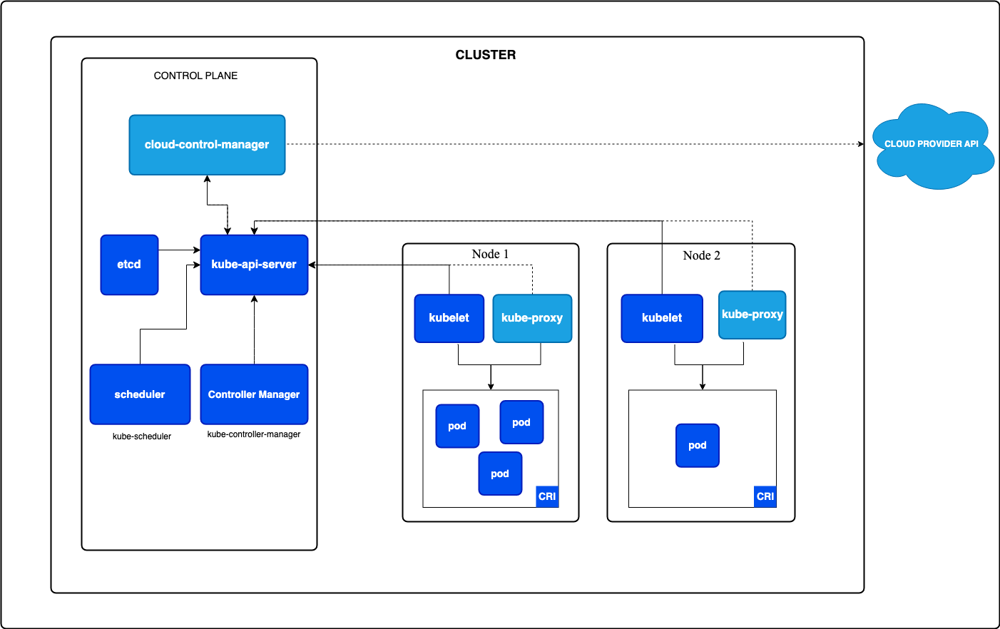

# Kubernetes Architecture

## 1. **Core Components**

Kubernetes architecture is composed of several core components that interact to provide a robust and scalable container orchestration platform.

### **1.1 Control Plane**

The Control Plane is responsible for managing the state of the cluster and orchestrating operations. It consists of several key components:

- **API Server**: The API server (kube-apiserver) is the central management entity in Kubernetes. It exposes the Kubernetes API and is responsible for handling all RESTful requests to the cluster. It serves as the gateway for communication between the Kubernetes cluster and external systems.

- **Controller Manager**: The controller manager (kube-controller-manager) is responsible for maintaining the desired state of the cluster. It includes various controllers, such as the ReplicaSet controller, which ensures the desired number of pod replicas are running.

- **Scheduler**: The scheduler (kube-scheduler) is responsible for assigning pods to nodes based on resource requirements and constraints. It ensures that workloads are efficiently distributed across the cluster.

- **etcd**: etcd is a distributed key-value store that serves as the source of truth for the cluster's configuration data and state. It stores all cluster data, including the state of all resources and configurations.

- **Cloud Controller Manager**: The cloud controller manager (cloud-controller-manager) integrates with cloud providers to manage cloud-specific resources, such as load balancers and storage.

### **1.2 Nodes**

Nodes are the worker machines in the Kubernetes cluster that run containerized applications. Each node is managed by the control plane and has the following components:

- **Kubelet**: The kubelet is an agent running on each node that ensures containers are running as specified by the Kubernetes API. It monitors the state of containers and reports back to the control plane.

- **Kube-Proxy**: The kube-proxy handles network routing and load balancing within the cluster. It manages network rules on nodes to ensure that traffic is properly directed to the appropriate pods.

- **Container Runtime**: The container runtime is responsible for running containers on each node. Kubernetes supports various runtimes, including Docker, containerd, and CRI-O.

## 2. **Key Kubernetes Objects**

Kubernetes uses several key objects to manage and deploy applications:

- **Pods**: Pods are the smallest deployable units in Kubernetes, consisting of one or more containers that share network and storage resources. Pods provide the execution environment for containers.

- **ReplicaSets**: ReplicaSets ensure that a specified number of pod replicas are running at any given time. They provide scalability and high availability for applications.

- **Deployments**: Deployments manage ReplicaSets and provide declarative updates to applications. They handle rolling updates and rollbacks, making it easy to deploy new versions of applications.

- **Services**: Services provide a stable network endpoint for accessing a set of pods. They enable load balancing and service discovery within the cluster.

- **ConfigMaps and Secrets**: ConfigMaps and Secrets are used to manage configuration data and sensitive information, respectively. They enable applications to retrieve configuration and secrets at runtime.

- **Namespaces**: Namespaces provide a mechanism for isolating resources within the cluster. They allow multiple teams or projects to share a cluster without interfering with each other's resources.

## 3. **Networking and Storage**

- **Networking**: Kubernetes employs a flat networking model, where every pod can communicate with every other pod in the cluster. It uses network policies and services to manage traffic and provide load balancing.

- **Storage**: Kubernetes supports various storage options, including persistent volumes (PVs) and persistent volume claims (PVCs). It allows applications to use cloud storage or on-premises storage systems.

## 4. **Deployment Strategies**

Kubernetes supports multiple deployment strategies to manage application updates:

- **Rolling Updates**: Gradually replaces instances of the old version with the new version, ensuring zero downtime.

- **Blue/Green Deployments**: Deploys a new version alongside the old version, and switches traffic to the new version once it's ready.

- **Canary Deployments**: Gradually rolls out changes to a subset of users before a full rollout, allowing for testing and validation.

## 5. **Advanced Features**

- **Custom Resource Definitions (CRDs)**: Allow users to define custom resources and controllers, extending Kubernetes' capabilities.

- **Operators**: Automate complex application lifecycle management tasks by extending Kubernetes with custom controllers.

- **Helm**: A package manager for Kubernetes that simplifies the deployment and management of applications using Helm charts.!