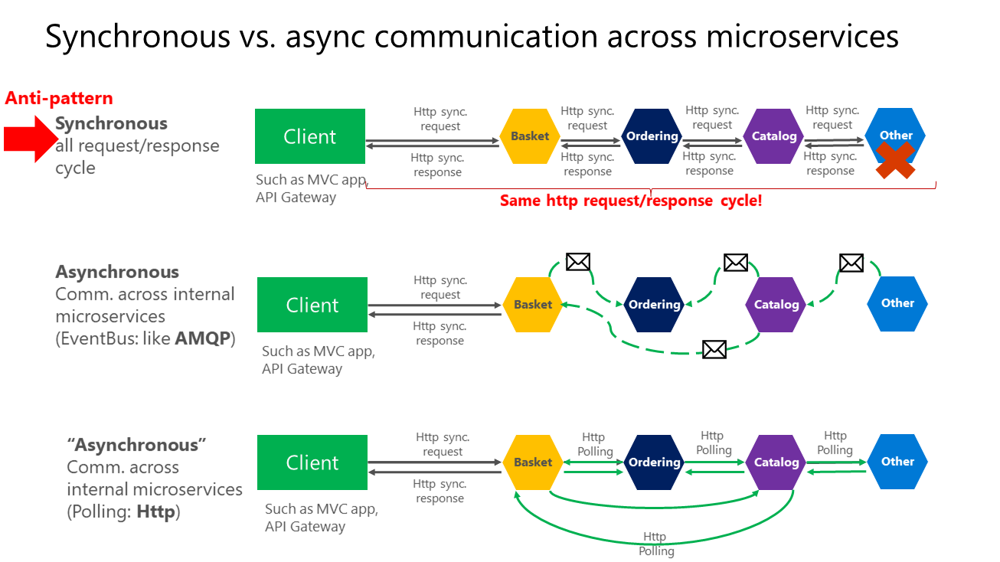

# Asynchronous Communication

## Description
Asynchronous communication is a method where services interact without waiting for an immediate response. It is used to decouple services, improve scalability, and handle unpredictable workloads. Asynchronous communication typically involves message brokers or event-driven systems, allowing services to continue processing while waiting for responses or events.



## Example: Asynchronous Order Processing with RabbitMQ

```java
// OrderService.java
@Service
public class OrderService {

    private final RabbitTemplate rabbitTemplate;

    @Autowired
    public OrderService(RabbitTemplate rabbitTemplate) {
        this.rabbitTemplate = rabbitTemplate;
    }

    public void createOrder(Order order) {
        // Logic for order creation
        rabbitTemplate.convertAndSend("order.exchange", "order.routing.key", order);
    }
}
```

```java
// PaymentService.java
@Service
public class PaymentService {

    @RabbitListener(queues = "order.queue")
    public void processPayment(Order order) {
        // Logic for processing payment
        System.out.println("Processing payment for order: " + order.getId());
    }
}
```

### Explanation
In this example, `OrderService` sends messages to a RabbitMQ exchange when a new order is created. The `PaymentService` listens to the queue and processes the payment asynchronously when a message arrives. This allows `OrderService` to send orders without waiting for the `PaymentService` to complete the payment processing.

### Trade-offs
**Pros:**
- **Decoupling:** Services are loosely coupled, making it easier to maintain and scale them independently.
- **Scalability:** Can handle high-throughput scenarios by scaling consumers.
- **Fault Tolerance:** Failures in the consumer do not directly impact the producer; messages can be retried or stored.

**Cons:**
- **Complexity:**
  Asynchronous communication introduces additional complexity to the architecture. It requires setting up and managing message brokers like RabbitMQ, Kafka, or ActiveMQ. Developers must handle messaging patterns, such as publishing/subscribing or message routing, and may need to implement custom retry policies, dead-letter queues, and message ordering guarantees. This additional complexity can increase the initial setup time, maintenance costs, and the learning curve for the development team.

- **Eventual Consistency:**
  Since asynchronous communication does not wait for an immediate response, the state between different services may not be consistent at any given moment. For example, after `OrderService` creates an order and sends a message to `PaymentService`, the payment might not be processed immediately. This means that the system may temporarily hold inconsistent states, which can lead to scenarios where other services or clients observe outdated or partial data until the messages are processed. Designing systems that can handle eventual consistency gracefully often requires additional thought and development effort.

- **Error Handling:**
  Handling errors in an asynchronous system is more challenging than in a synchronous system. Since the sender does not receive an immediate response, it is harder to determine if a failure has occurred. Errors can happen at various stages, such as during message transmission, in the message broker, or on the consumer side. Implementing effective error handling, such as retries, dead-letter queues, or compensating transactions, requires careful planning and testing. Additionally, if a service fails to process a message and the error is not properly handled, it can lead to data loss, duplication, or inconsistencies.

- **Debugging and Monitoring:**
  Debugging asynchronous communication can be more challenging because the flow of data is not linear. Tracing a message from its origin through multiple services requires comprehensive logging and monitoring. Developers often need to use distributed tracing tools and log aggregators to track the lifecycle of a message across services. Monitoring the health and performance of message brokers, consumer lag, and queue depth adds additional overhead to the system's observability.

- **Latency:**
  Although asynchronous communication is often used to improve performance by offloading tasks, it can also introduce latency in processing. This is because messages may need to be queued, transferred, and processed asynchronously, which is not instantaneous. In time-sensitive applications, such as those requiring real-time responses, the delay introduced by asynchronous communication may be unacceptable.