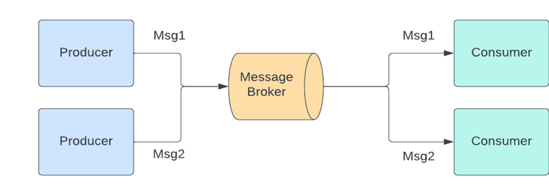

# Introduction to Message Brokers

Message Brokers are intermediaries that enable communication between microservices by managing the transmission of messages. They facilitate asynchronous communication and decouple the producer and consumer services, which enhances the scalability and reliability of the system.

## Key Concepts

* **Producer** – the application responsible for sending messages. It’s connected with the message broker. In publish/subscribe pattern (we’ll move on to that) they are called publishers. 
* **Consumer** – the endpoint that consumes messages waiting in the message broker. In publish/subscribe pattern they are called subscribers. 
* **Queue/topic** – a folder in a filesystem. Message broker uses them to store messages.

## Common Models

**Point-to-Point Messaging**

This is the distribution pattern used in message queues where the sender and receiver have a one-to-one relationship. Each message in the queue is sent to and consumed by a single recipient. When a message must be acted on only once, point-to-point messaging is used.

Payroll and financial transaction processing are two examples of applications for this distribution pattern. Both senders and receivers in these systems require assurance that each payment will be sent only once.

**Publish/Subscribe Messaging**

In this message distribution pattern, also known as “pub/sub,” the message producer publishes each message to a topic, and multiple message consumers subscribe to topics from which they want to receive messages. All messages posted to a topic are distributed to all applications that have subscribed to it. This is a broadcast-style distribution method in which the message’s publisher and consumers have a one-to-many relationship.

Example: In a typical eCommerce system, when an order is placed, the order service can send a message to a message broker, which then forwards this message to various services such as inventory, shipping, and payment services.

- **Order Service** sends an order message to a Message Broker (e.g., RabbitMQ, Apache Kafka).
- **Message Broker** queues the message and ensures it is delivered to the subscribed services.
- **Inventory Service**, **Shipping Service**, and **Payment Service** receive the message and perform their respective actions.

## Trade-offs

**Pros**
1. **Decoupling:** Services are decoupled from each other, making the system more modular and easier to manage.
2. **Scalability:** Message brokers can handle a high volume of messages, allowing services to scale independently.
3. **Fault Tolerance:** If a consumer service fails, the message broker can hold the message until the service recovers or another instance is available.
4. **Asynchronous Processing:** Enables asynchronous processing, which improves the system's performance and responsiveness.

**Cons**
1. **Complexity:** Adding a message broker introduces additional complexity in terms of configuration, monitoring, and management.
2. **Latency:** There might be an added latency due to the time it takes for messages to be queued and processed.
3. **Overhead:** There is some overhead related to the serialization and deserialization of messages.
4. **Potential for Message Loss:** Depending on the broker configuration and network issues, messages might be lost or duplicated.
