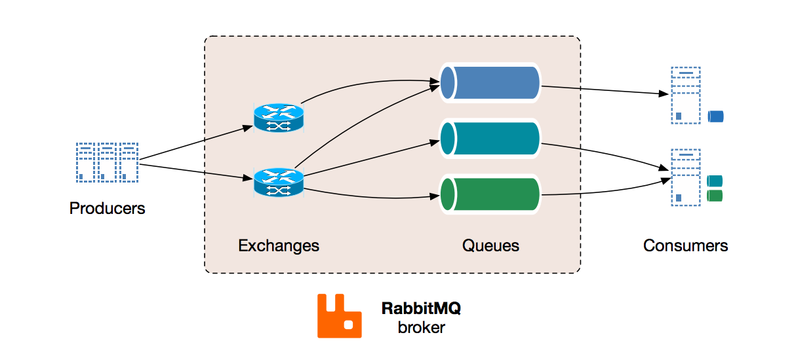
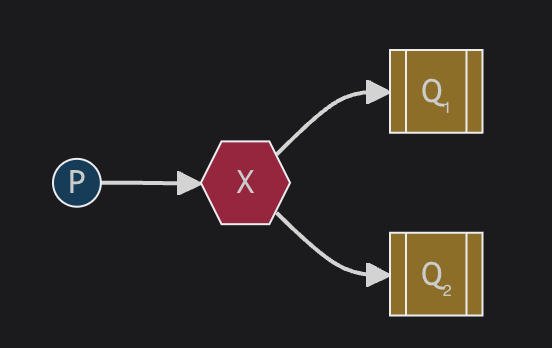

# Introduction to RabbitMQ

RabbitMQ is a widely used open-source message broker that implements the Advanced Message Queuing Protocol (AMQP). It enables applications to communicate by sending messages to a queue, where they can be processed asynchronously. RabbitMQ supports complex routing scenarios and provides reliable delivery and flexible messaging patterns.



## Example:

### Queue based - RabbitMQ Setup in Spring Boot

**Dependencies**

Add the following dependency to your `pom.xml`:

```xml
<dependency>
    <groupId>org.springframework.boot</groupId>
    <artifactId>spring-boot-starter-amqp</artifactId>
</dependency>
```

**Spring Boot Configuration**

```java
import org.springframework.amqp.core.Queue;
import org.springframework.amqp.rabbit.annotation.EnableRabbit;
import org.springframework.amqp.rabbit.annotation.RabbitListener;
import org.springframework.amqp.rabbit.core.RabbitTemplate;
import org.springframework.amqp.rabbit.core.RabbitAdmin;
import org.springframework.context.annotation.Bean;
import org.springframework.context.annotation.Configuration;

@Configuration
@EnableRabbit
public class RabbitMQConfig {

    @Bean
    public Queue myQueue() {
        return new Queue("myQueue", false);
    }

    @Bean
    public RabbitAdmin rabbitAdmin(RabbitTemplate rabbitTemplate) {
        return new RabbitAdmin(rabbitTemplate);
    }
}
```

*Sender*

```java
import org.springframework.amqp.rabbit.core.RabbitTemplate;
import org.springframework.stereotype.Service;

@Service
public class MessageSender {

    private final RabbitTemplate rabbitTemplate;

    public MessageSender(RabbitTemplate rabbitTemplate) {
        this.rabbitTemplate = rabbitTemplate;
    }

    public void sendMessage(String message) {
        rabbitTemplate.convertAndSend("myQueue", message);
    }
}
```

*Receiver*

```java
import org.springframework.amqp.rabbit.annotation.RabbitListener;
import org.springframework.stereotype.Service;

@Service
public class MessageReceiver {

    @RabbitListener(queues = "myQueue")
    public void receiveMessage(String message) {
        System.out.println("Received: " + message);
    }
}
```

**Creating a Queue Manually via the RabbitMQ Management Console:**

To create the queue manually, follow these steps:

1. Access the RabbitMQ Management Console:
   * Open a web browser and go to the RabbitMQ Management Console, typically available at http://localhost:15672 (the default address).
   * Log in using your RabbitMQ credentials. The default username and password are both guest.

2. Navigate to the Queues Tab:
   * Click on the "Queues" tab in the top menu.

3. Add a New Queue:
   * Click on the "Add a new queue" button.
   * Enter the following details:
     - Name: myQueue (or any name that matches what you used in your code).
     - Durability: Select whether the queue should be durable (survives broker restarts) or transient.
     - Other settings: Leave the other settings at their default values unless specific configurations are needed.
   * Click "Add Queue".

4. Verify Queue Creation:
   * You should now see the queue "myQueue" listed under the "Queues" tab.

**Explanation:**
In this example, we configure RabbitMQ with a queue named `myQueue`. The `MessageSender` class sends messages to this queue using `RabbitTemplate`. The `MessageReceiver` class listens to the queue and processes incoming messages. RabbitMQ handles the message queuing, ensuring messages are reliably delivered even if the receiver is temporarily unavailable.

### Publisher/Subscriber (Pub/Sub) configuration

To implement a **Publisher/Subscriber (Pub/Sub) configuration** with RabbitMQ using Spring, you will need to set up an **Exchange** and bind it to one or more **Queues**. This way, messages published to the exchange can be routed to the bound queues based on a specific routing key or binding pattern.



**Manual Queue and Exchange Creation in RabbitMQ:**

1. Access the RabbitMQ Management Console

   1. Open your browser and navigate to the RabbitMQ Management Console at `http://localhost:15672`.
   2. Log in with the default credentials: `guest/guest`.

2.  Create an Exchange

    1. Go to the **"Exchanges"** tab.
    2. Click on **"Add a new exchange"**.
    3. Enter the following details:
       - **Name:** `myExchange`
       - **Type:** `fanout` (For Pub/Sub, the `fanout` type is typically used as it broadcasts all messages to all bound queues.)
       - **Durable:** `True` (or `False`, depending on whether you want the exchange to survive broker restarts)
    4. Click **"Add exchange"**.

3. Create Queues
   1. Go to the **"Queues"** tab.
   2. Click on **"Add a new queue"**.
   3. Enter the following details for each queue:
      - **Name:** `queue1` (and `queue2` for the second queue)
      - **Durable:** `True` or `False` (depending on your requirement)
   4. Click **"Add queue"** for each queue.

4. Bind Queues to the Exchange

   1. Go back to the **"Exchanges"** tab.
   2. Find the exchange named `myExchange` and click on it.
   3. Scroll down to the **"Bindings"** section.
   4. Under **"Add binding from this exchange"**:
      - **Destination:** Select `queue1` from the dropdown.
      - **Routing key:** Leave it empty or use any routing key since `fanout` does not use routing keys.
      - Click **"Bind"**.
  
5. Repeat the same binding steps for `queue2`.

**Spring Boot Application Code for Pub/Sub Configuration:**

Now, let’s create a Spring Boot application that demonstrates a publisher/subscriber setup with the manual configurations done above.

**Add Dependencies**

Include the `spring-boot-starter-amqp` dependency in your `pom.xml`:

```xml
<dependency>
    <groupId>org.springframework.boot</groupId>
    <artifactId>spring-boot-starter-amqp</artifactId>
</dependency>
```

**Spring Configuration**

Configure the RabbitMQ exchange and queues in your Spring Boot application:

```java
import org.springframework.amqp.core.FanoutExchange;
import org.springframework.amqp.rabbit.annotation.EnableRabbit;
import org.springframework.amqp.rabbit.core.RabbitTemplate;
import org.springframework.context.annotation.Bean;
import org.springframework.context.annotation.Configuration;

@Configuration
@EnableRabbit
public class RabbitMQConfig {

    @Bean
    public FanoutExchange fanoutExchange() {
        // The exchange name must match the manually created exchange in RabbitMQ
        return new FanoutExchange("myExchange");
    }
}
```

*Publisher Service*

Create a service to publish messages to the `fanout` exchange:

```java
import org.springframework.amqp.rabbit.core.RabbitTemplate;
import org.springframework.stereotype.Service;

@Service
public class MessagePublisher {

    private final RabbitTemplate rabbitTemplate;

    public MessagePublisher(RabbitTemplate rabbitTemplate) {
        this.rabbitTemplate = rabbitTemplate;
    }

    public void publishMessage(String message) {
        // Publish message to the 'myExchange' with an empty routing key
        rabbitTemplate.convertAndSend("myExchange", "", message);
        System.out.println("Published: " + message);
    }
}
```

*Subscriber Service*

Create subscriber services to listen to the queues (`queue1` and `queue2`):

```java
import org.springframework.amqp.rabbit.annotation.RabbitListener;
import org.springframework.stereotype.Service;

@Service
public class SubscriberService {

    @RabbitListener(queues = "queue1")
    public void receiveMessageFromQueue1(String message) {
        System.out.println("Subscriber 1 received: " + message);
    }

    @RabbitListener(queues = "queue2")
    public void receiveMessageFromQueue2(String message) {
        System.out.println("Subscriber 2 received: " + message);
    }
}
```

**Explanation:**

- **Exchange Configuration:** The `fanout` exchange (`myExchange`) broadcasts all messages to all bound queues (`queue1` and `queue2`). This means every message sent to `myExchange` will be received by all subscribers listening to these queues.
- **Publisher:** The `MessagePublisher` service publishes messages to the `myExchange`. Since it is a `fanout` exchange, it ignores any routing key, and the message is sent to all bound queues.
- **Subscribers:** Two subscriber services are created to listen to `queue1` and `queue2`. Both will receive all messages sent to the exchange.

### Exception and Message Acknowledgement

If the RabbitMQ consumer throws an exception and manual acknowledgment mode (`ackMode = "MANUAL"`) used, the message will not be acknowledged automatically, and this may result in a `nack` (negative acknowledgment) or the message remaining unacknowledged, depending on how the message listener container is configured.

### Default Behavior When an Exception Is Thrown

1. **Manual Acknowledgment Mode (`ackMode = "MANUAL"`):**
   - If your consumer throws an exception in manual acknowledgment mode, you must explicitly handle the acknowledgment. If you do not call either `acknowledge()` or `nack()` within your code, the message remains unacknowledged.
   - When a message remains unacknowledged and the consumer disconnects or shuts down, the RabbitMQ broker will automatically requeue the message or handle it according to the queue's configuration.

2. **Automatic Acknowledgment Mode (`ackMode = "AUTO"` or Default):**
   - If you are using the default acknowledgment mode (`AUTO`), the Spring framework will handle acknowledgment automatically.
   - When an exception is thrown, the message is considered as not successfully processed, and Spring will automatically send a `nack` with requeue (`requeue = true`). This will cause the message to be put back into the queue for redelivery.
   - If you want different behavior (such as sending a `nack` without requeueing), you need to customize the error handling logic.

**Example of Exception Handling in `@RabbitListener` with Manual Acknowledgment**

Here is an example that demonstrates how to explicitly handle exceptions and manage acknowledgment in manual mode:

```java
import org.springframework.amqp.rabbit.annotation.RabbitListener;
import org.springframework.amqp.core.Message;
import org.springframework.amqp.rabbit.support.Acknowledgment;
import org.springframework.stereotype.Service;

@Service
public class RabbitMqConsumer {

    @RabbitListener(queues = "your-queue-name", ackMode = "MANUAL")
    public void consumeMessage(Message message, Acknowledgment acknowledgment) {
        try {
            // Process the message
            String messageBody = new String(message.getBody());
            System.out.println("Received message: " + messageBody);

            // Simulate processing logic
            boolean processingSuccessful = processMessage(messageBody);

            if (processingSuccessful) {
                // Acknowledge the message if processing is successful
                acknowledgment.acknowledge();
            } else {
                // Negative acknowledge the message without requeueing
                acknowledgment.nack(false); // nack the message, do not requeue
            }

        } catch (Exception e) {
            // Handle the error and negatively acknowledge the message with requeue
            System.err.println("Exception occurred while processing message: " + e.getMessage());
            acknowledgment.nack(true); // nack the message, requeue
        }
    }

    private boolean processMessage(String messageBody) throws Exception {
        // Your message processing logic here
        // Throw an exception to simulate processing failure
        throw new Exception("Processing failed");
    }
}
```

### Configuration of `SimpleRabbitListenerContainerFactory` for Manual Ack

If you want to handle exceptions differently, configure your listener container factory for custom error handling. For example:

```java
import org.springframework.amqp.rabbit.config.SimpleRabbitListenerContainerFactory;
import org.springframework.amqp.rabbit.connection.ConnectionFactory;
import org.springframework.context.annotation.Bean;
import org.springframework.context.annotation.Configuration;
import org.springframework.amqp.core.AcknowledgeMode;

@Configuration
public class RabbitMQConfig {

    @Bean
    public SimpleRabbitListenerContainerFactory rabbitListenerContainerFactory(ConnectionFactory connectionFactory) {
        SimpleRabbitListenerContainerFactory factory = new SimpleRabbitListenerContainerFactory();
        factory.setConnectionFactory(connectionFactory);
        factory.setAcknowledgeMode(AcknowledgeMode.MANUAL); // Set manual acknowledgment mode
        factory.setDefaultRequeueRejected(false); // Do not requeue on error
        return factory;
    }
}
```

### Summary of Behavior Based on Ack Mode

- **Manual Mode (`ackMode = "MANUAL"`):**  
  You must explicitly handle the acknowledgment (using `acknowledge()` or `nack()`). If an exception is thrown, the message remains unacknowledged and will be requeued or sent to a Dead Letter Queue based on the configuration.

- **Auto Mode (`ackMode = "AUTO"` or Default):**  
  The message is automatically acknowledged or negatively acknowledged by Spring based on whether the method completes successfully or throws an exception. By default, if an exception is thrown, the message is `nack`ed with `requeue = true`.

By choosing the correct acknowledgment strategy, you can control how your application handles messages in various failure scenarios.

## Trade-offs:

**Pros:**
1. **Reliability:** RabbitMQ ensures reliable message delivery with features like acknowledgments and durable queues.
2. **Flexibility:** Supports various messaging patterns such as point-to-point, publish/subscribe, and routing.
3. **Scalability:** Can handle high-throughput scenarios and supports clustering for scaling.
4. **Decoupling:** On Pub/Sub Configuration - Publishers and subscribers are decoupled, allowing for independent scaling and modification.

**Cons:**
1. **Complexity:** Configuration and management can be complex, especially in large-scale deployments.
2. **Latency:** Introduces latency in message processing due to the asynchronous nature of message handling.
3. **Resource Consumption:** Requires additional resources for running and maintaining the RabbitMQ broker.